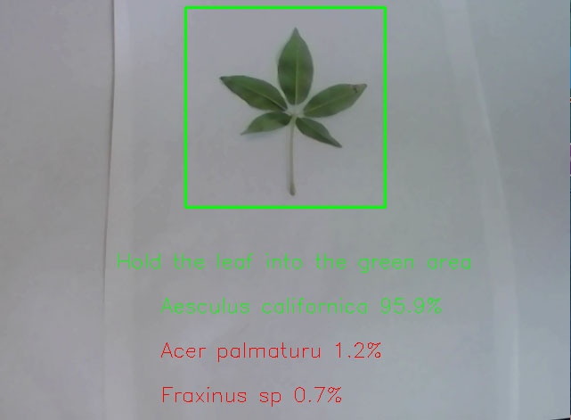

# leaf-classifier
A Real-time Leaf Classifier using Tensorflow/Keras (mobilenet_v2)

This is a small app to classify leaves of 40 classes using the webcam. 

The mobilenet_v2 was trained on this dataset: http://archive.ics.uci.edu/ml/datasets/Leaf, which is also
included as a zip-file in the repository.

##### The program was tested on following setup:

- Windows 10 Pro (Build 19042)
- AMD Ryzen 7 1800X (3600 Mhz, 8 Core)
- Nvidia GTX 980 (4GB Video Ram)
- 32 GB Memory
- Python 3.8.5

### Required Packages:

Python>= 3.8.4

opencv-python>=4.4.0.46

numpy>=1.19.5

pillow>=8.1.0

tensorflow>=2.4.0

### Usage:

**Predict:**

Just make sure you are connected to a webcam and start the program in a new shell with: 

python detect_leaves.py 

**Train:**

1. Unzip data.zip (or use another dataset but make sure it has the same structure as the data folder in this repo)

2. Use train_model.ipynb to train your own model in Jupyter

   

